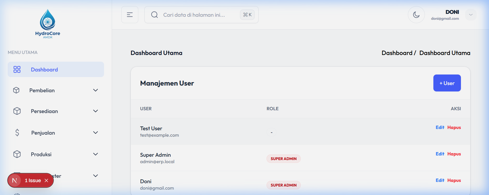
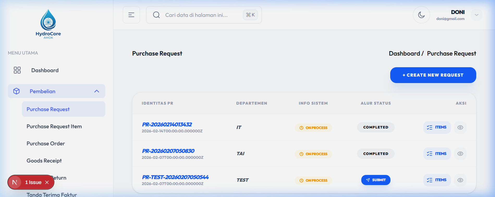
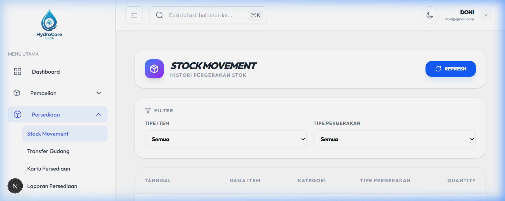
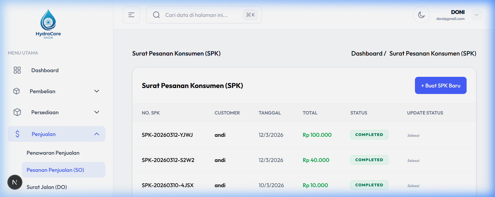
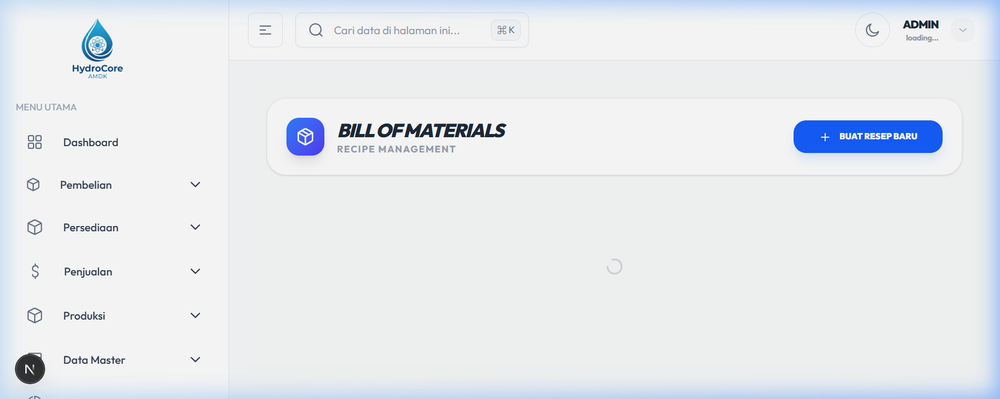
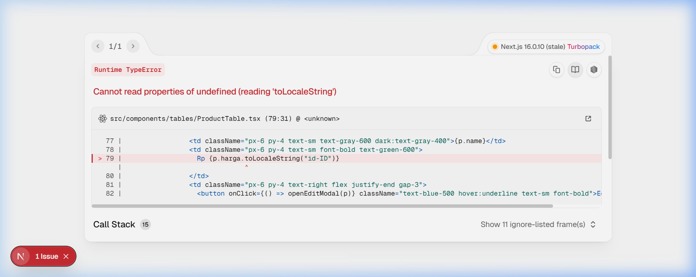
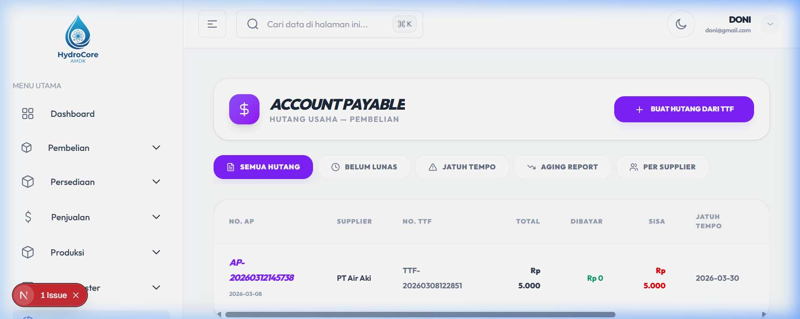

# ERP Manufactura DKM - Frontend Documentation

Selamat datang di dokumentasi frontend untuk aplikasi ERP Manufactura DKM. Frontend ini dibangun menggunakan **Next.js 16**, **React 19**, **TypeScript**, dan **Tailwind CSS**.

---

## 1. File .env & Konfigurasi

Untuk menghubungkan frontend dengan backend API, Anda perlu mengatur variabel lingkungan.

### Setup Variabel Lingkungan
1. Salin file `.env.example` menjadi `.env.local`:
   ```bash
   cp .env.example .env.local
   ```
2. Pastikan file `.env.local` berisi URL yang benar untuk backend API Anda:
   ```env
   NEXT_PUBLIC_API_URL=http://localhost:8000
   ```
   *Ganti `http://localhost:8000` dengan URL API backend Anda jika berbeda.*

---

## 2. Instalasi & Menjalankan Aplikasi

Ikuti langkah-langkah berikut untuk menjalankan aplikasi di lingkungan lokal Anda:

### Prasyarat
- Node.js 18.x atau lebih baru (Disarankan v20.x+)
- npm atau yarn

### Langkah Instalasi
1. Masuk ke direktori frontend:
   ```bash
   cd frontend
   ```
2. Instal dependensi:
   ```bash
   npm install
   ```

### Menjalankan Development Server
Untuk mulai mengembangkan atau melihat perubahan secara langsung:
```bash
npm run dev
```
Aplikasi akan tersedia di [http://localhost:3000](http://localhost:3000).

### Build untuk Produksi
Untuk membangun aplikasi untuk lingkungan produksi:
```bash
npm run build
npm start
```

---

## 3. Manual Book (Panduan Pengguna)

Bagian ini menjelaskan alur kerja dan fitur-fitur yang tersedia di dalam aplikasi ERP Manufactura DKM.

### Akses Login
Pengguna harus login terlebih dahulu untuk mengakses dashboard.
- **Halaman Login**: `/signin`
- **Akun Demo**: `doni@gmail.com` / `password123`

### Dashboard
Halaman utama yang menyajikan ringkasan data operasional secara visual menggunakan grafik dan kartu statistik.
- Menampilkan tren penjualan bulanan.
- Ringkasan stok dan status keuangan.



### Modul Pembelian (Purchasing)
Digunakan untuk mengelola siklus pengadaan barang (procurement).
- **Purchase Request**: Pengajuan permintaan barang internal.
- **Purchase Order**: Pembuatan pesanan ke supplier.
- **Goods Receipt**: Pencatatan penerimaan barang.
- **Tanda Terima Faktur (TTF)**: Verifikasi tagihan dari supplier.



### Modul Persediaan (Inventory)
Mengelola pergerakan barang di dalam gudang.
- **Stock Movement**: Riwayat keluar masuknya stok.
- **Transfer Gudang**: Memindahkan stok antar lokasi gudang.
- **Penyesuaian Stok**: Koreksi jumlah stok fisik.
- **Stok Awal**: Inisialisasi saldo stok awal.



### Modul Penjualan (Sales)
Mengelola siklus pendapatan dari pelanggan.
- **Penawaran Penjualan**: Pembuatan quotation untuk calon pembeli.
- **Pesanan Penjualan (SO)**: Konfirmasi pesanan pelanggan.
- **Surat Jalan (DO)**: Dokumen pengiriman barang.
- **Invoice Penjualan**: Tagihan kepada pelanggan.



### Modul Produksi
Mengelola proses manufaktur barang jadi.
- **Bill of Material (BOM)**: Resep atau daftar bahan baku untuk sebuah produk.
- **Production Order**: Perintah kerja untuk memulai proses produksi.
- **Produk Eksekusi**: Hasil akhir dari proses produksi.



### Data Master
Pusat pengaturan data dasar yang digunakan oleh seluruh modul.
- **Data Customer & Supplier**: Pengelolaan mitra bisnis.
- **Data Produk**: Detail spesifikasi produk.
- **Chart of Accounts (COA)**: Daftar akun untuk kebutuhan akuntansi.



### Keuangan & Akuntansi
Monitoring hutang, piutang, dan pencatatan jurnal.
- **Account Payable**: Monitoring hutang kepada supplier.
- **Account Payment**: Pencatatan pelunasan hutang.
- **Jurnal & Buku Besar**: Pencatatan transaksi keuangan secara otomatis dari modul lain.



---

## License
ERP Manufactura DKM Frontend is a private project. All rights reserved.
